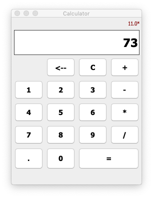
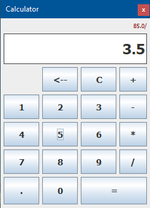

># Calculator App
>
>A simple Calculator written in Java

## License

This project is protected by the [_**Eclipse Public License v2.0**_](LICENSE).

As of this, it's copyright protected and open-source.

## Project

The goal of this project is to offer a very simple calculator app, capable of doing simple operations like:

- an addition,
- a substraction,
- a multiplication,
- a division.

It's not maint to replace the calculator natively installed on your computer neither to make several operations at once.

I personnally decided to make this project in order to exercise myself on writing in Java.

### Installation

In order to be able to use the [JAR file](Calaculator-App.jar), you need to first install a Java JDK.
You will need JDK 11+.

I recommend you to install it via [AdoptOpenJDK](https://adoptopenjdk.net/).

### Enjoy!

Here's a screenshot of the Calculator App running on different OS.

| macOS | Windows 10|
:------:|:----------:
 | 
